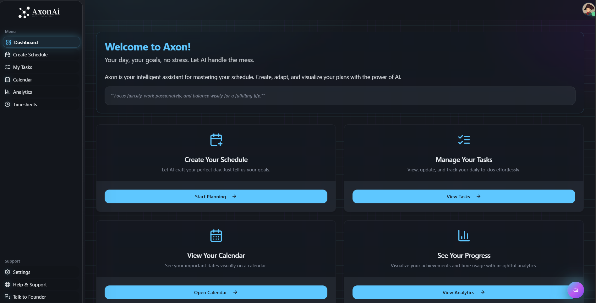

AxonAI is an AI-integrated productivity and planning tool that helps you organize your day, prioritize tasks, and optimize time management through intelligent scheduling. Powered by AI, it can generate daily plans, break down large tasks, reallocate schedules when plans change, and assist with meeting preparation and analytics.

## ✨ Features

AxonAI comes packed with features to help you stay organized and achieve your goals:

- **AI-Powered Schedule Creation:** Describe your ideal day or goals in natural language, and let our AI craft a smart, segmented schedule with work and rest times.
- **Comprehensive Task Management:** Create, view, update, delete, and track your daily to-dos. Filter tasks by status, priority, and search terms.
- **Intelligent Task Breakdown:** Input a large task and its deadline, and AI will break it down into manageable sub-tasks with estimated time allocations.
- **Dynamic Task Reallocation:** Life happens! If you need to reschedule, tell AI the reason, provide your current tasks, and it will intelligently reallocate them to new slots.
- **🎤 Meeting & Speech Preparation:** Input your calendar event and current tasks. AI will adjust your schedule, compress preparation times, and generate reminders and speaker checklists.
- **Productivity Analytics:**
  - **Task Progress:** Visualize your task completion status with an intuitive pie chart.
  - **Time Usage:** Understand how you spend your time across different activities with a weekly bar chart.
  - **Efficiency Score:** Get a score based on task completion rates and deferments.
  - **Burnout Predictor:** AI-driven insights into your work patterns to predict and help prevent burnout.
- **Modern & Responsive UI:** Built with Next.js, React, ShadCN UI, and Tailwind CSS for a beautiful and accessible experience on all devices.

## 🛠️ Tech Stack

- **Frontend:** Next.js (App Router), React, TypeScript
- **UI Components:** ShadCN UI
- **Styling:** Tailwind CSS
- **Generative AI:** Google Gemini models via Genkit
- **State Management:** React Hook Form, TanStack Query (React Query)
- **Charting:** Recharts

## 🚀 Getting Started

To get a local copy up and running, follow these simple steps.

### Prerequisites

- Node.js (v18 or newer recommended)
- npm or yarn

### Installation

1.  Clone the repo:
    ```sh
    git clone https://github.com/Geotechcompany/AxonAi.git
    ```
2.  Navigate to the project directory:
    ```sh
    cd AxonAi
    ```
3.  Install NPM packages:
    ```sh
    npm install
    ```
4.  Set up your environment variables:
    Copy `.env.example` → `.env.local` and fill in real values. If you’re using Google Gemini via Genkit, set your API key; if you’re using NVIDIA as the AI provider, set the NVIDIA vars:
    ```env
    GOOGLE_API_KEY=YOUR_GOOGLE_API_KEY
    ```
    _You can obtain a Google API key from the [Google AI Studio](https://aistudio.google.com/app/apikey)._
5.  Run the development server:
    ```sh
    npm run dev
    ```
    This will start the Next.js app (usually on `http://localhost:9005`) and the Genkit development server.

## 🗓️ Microsoft / Teams Calendar (Signed-in user)

This app can pull the signed-in user’s calendar via **Microsoft Graph**. A “Teams meeting” will show up as a normal calendar event with `isOnlineMeeting: true`.

### Setup

- **Create an Entra ID (Azure AD) App Registration**
  - **Redirect URI**: `https://YOUR_DOMAIN/api/microsoft/callback` (or your local dev URL)
  - **API permissions (Delegated)**: `User.Read`, `Calendars.Read`, `offline_access`

- **Add env vars**
  - Copy `.env.example` → `.env.local` and fill:
    - `MICROSOFT_CLIENT_ID`
    - `MICROSOFT_CLIENT_SECRET` (**use the secret VALUE, not the Secret ID**)
    - (optional) `MICROSOFT_TENANT_ID`

### Endpoints

- `GET /api/microsoft/auth?uid=...&returnTo=/settings` starts OAuth
- `GET /api/microsoft/calendar?uid=...` returns the next 7 days of events (use `start`, `end`, `tz` to customize)

## 🤝 Contributing

Contributions are what make the open-source community such an amazing place to learn, inspire, and create. Any contributions you make are **greatly appreciated**.

If you have a suggestion that would make this better, please fork the repo and create a pull request. You can also simply open an issue with the tag "enhancement".
Don't forget to give the project a star! Thanks again!

1.  Fork the Project
2.  Create your Feature Branch (`git checkout -b feature/AmazingFeature`)
3.  Commit your Changes (`git commit -m 'Add some AmazingFeature'`)
4.  Push to the Branch (`git push origin feature/AmazingFeature`)
5.  Open a PullRequest

## 📜 License

This project is licensed under the [MIT License](LICENSE).  
© Geotechcompany — Geotechcompanybrite@gmail.com

## 🏆 Acknowledgements & Ownership

This project, AxonAI, is envisioned, developed, and maintained by **Geotechcompany Singh ([@Geotechcompany6673](https://github.com/Geotechcompany6673))**. All credit for the concept and core development goes to him.

A big thank you to the open-source community for the tools and libraries that make projects like this possible!

---

## Powered By

[]()

This project is made possible by the generous funding and support from these amazing companies, helping this project to be free forever and open-source:

- **Google:** We are grateful to Google for their support towards **early-stage AI-first startups with equity funding**, which has been foundational for this project.

- **Google Cloud:** Our deepest thanks to Google Cloud for their substantial support, including:

  - **Year 1:** 100% up to **$250,000 USD in Google Cloud credits** (includes standard program credits plus an additional $150,000 USD for the AI startup program).
  - **Year 2:** 20% up to an additional **$100,000 USD in Google Cloud credits**.
  - **Enhanced Support:** **$12,000 USD in Google Cloud Enhanced Support credits** for one year.
  - **Google Workspace Business Plus:** 12 months of free Google Workspace Business Plus for new signups.

- **Gemini (Google AI):** We specifically thank Gemini for the **API expenses of Gemini 2.5 Pro (beta)**, integral to our vision of testing and which has mutually benefited both Google and our project. Additionally, as Scale tier members, we can utilize existing credits on Google Gemini and Vertex AI open models. As AI Tier startups, we also receive **$10,000 USD exclusively for partner LLM models** through Model Garden, including Anthropic, Mistral, and AI21.

- **Firebase:** For providing a **premium account**, essential for maintaining the legacy of the project and ensuring fast authentication and reliable storage.

- **Name.com:** Our gratitude to Name.com for providing a **free domain name** to this open-source project, a collaboration made possible through GitHub Education.

- **GitHub:** Thanks to GitHub for providing a **free GitHub Pro account** to the maintainer, which significantly boosted our workflow with faster GitHub Actions, serving as an incredibly fast preview environment. We also appreciate their role in collaborating with Name.com for the domain and **connecting our project to the broader open-source community in Delhi, India**.

- **Vercel:** A big thank you to Vercel for giving us a **free premium account** for deploying this project to the live internet, ensuring speed and reliability.

- **Notion:** We thank Notion for their guidance, helping us build a simpler planner experience, and for generously providing **free Notion Premium accounts to all the maintainers**.

---
